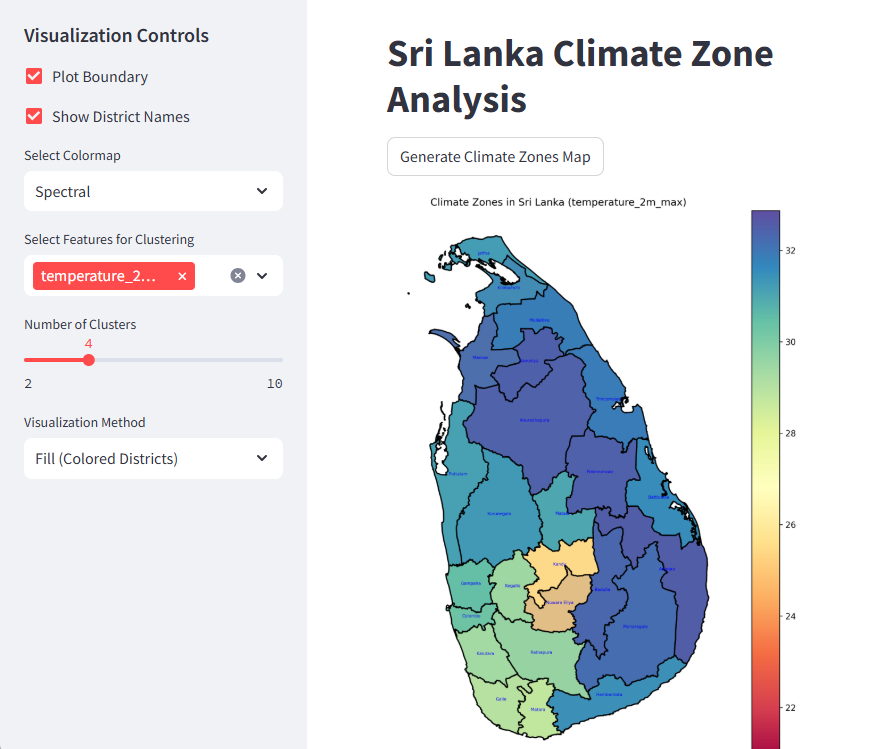

# Sri Lanka Climate Zone Analysis



## Project Overview
An interactive Streamlit application for analyzing and visualizing climate zones in Sri Lanka using machine learning and geospatial techniques.

## Features
- Interactive climate zone mapping
- Multiple visualization methods
- Clustering-based climate analysis

## Installation

### Prerequisites
- Python 3.8+
- pip

### Setup
```bash
# Clone the repository
git clone https://github.com/TharinduMadhusanka/sri-lanka-climate-zones.git

# Navigate to project directory
cd sri-lanka-climate-zones

# Create virtual environment
python -m venv venv
source venv/bin/activate  # On Windows use `venv\Scripts\activate`

# Install requirements
pip install -r requirements.txt
```

### Download Data Files to the Directory

1. **Climate Data**: [Sri Lanka Climate Data](https://www.kaggle.com/datasets/tharindumadhusanka9/sri-lanka-climate-data)  
2. **Shape File**: [Sri Lanka - Subnational Administrative Boundaries](https://www.kaggle.com/datasets/tharindumadhusanka9/sri-lanka-subnational-administrative-boundaries)

- Make sure both file path are correct in src/load_data.py
